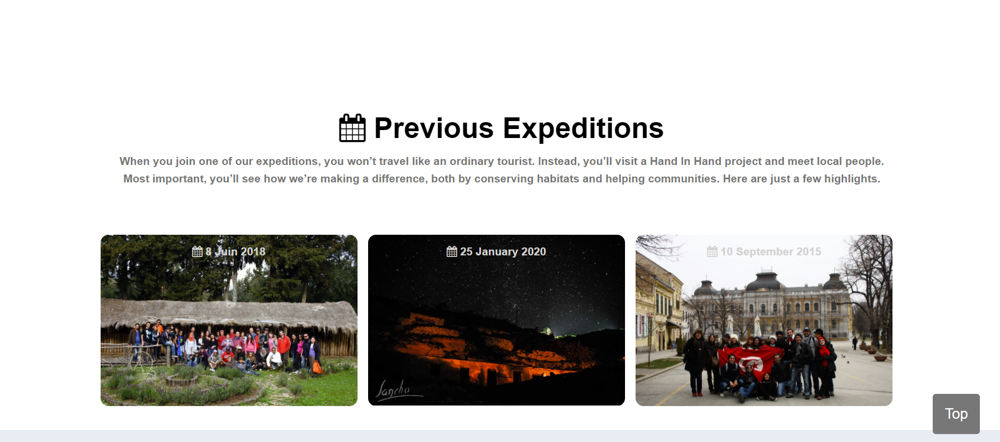
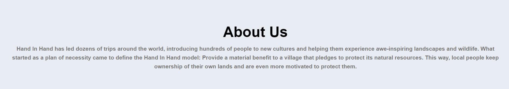
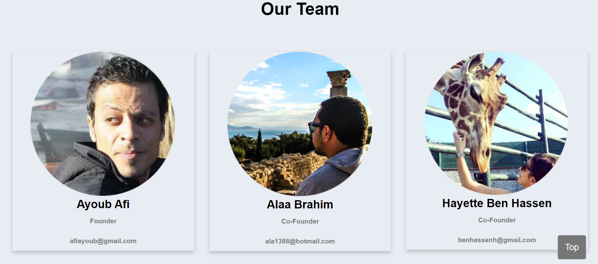

 * Introduction  
 Interactive Front-End web application using HTML and CSS based on the principles of user experience design, accessibility and responsivity.
Hand in hand is a single web application which serve sustainable tourism, the main purpose of this application is to promote sustainable tourism in the rural area.

### Home Page:

### Activities Page:

### Expeditions Page:

### About Us Page:

### Contact and Newsletter Page:

### Mobile friendly:

 * Recommended modules 
In order to run this application, your browser should have :
 - Css
 - Html
 - Javascript

 * Installation  
In order to use this software, open index.html in a web browser (depending on your operating system or computer settings, you can either double click the file and it should automatically open in your default browser or right click the file and choose “open with” and then select your browser).

