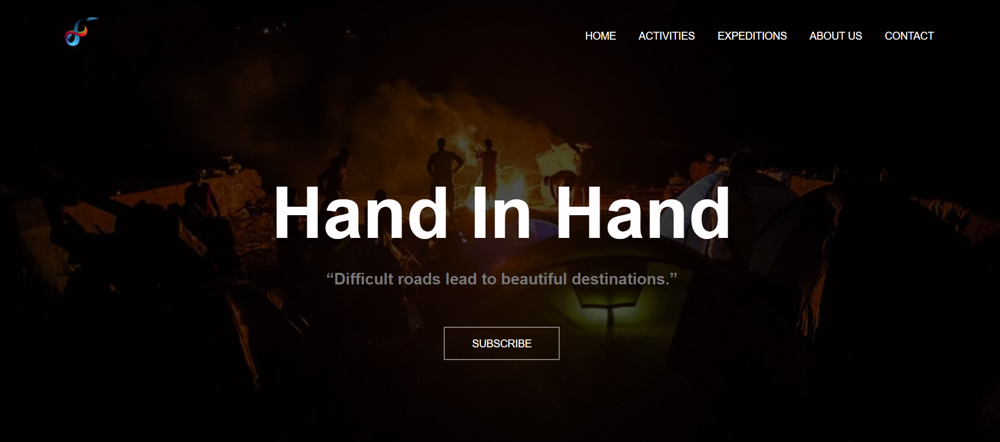
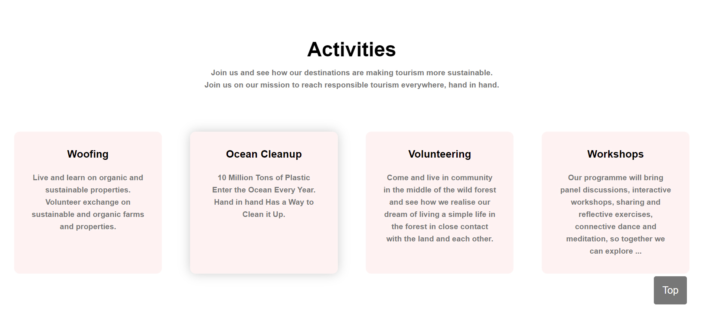
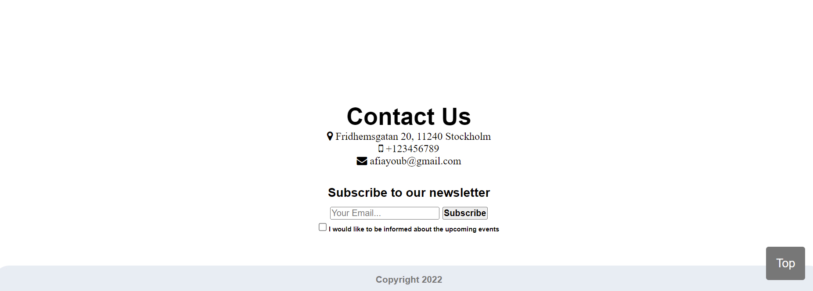
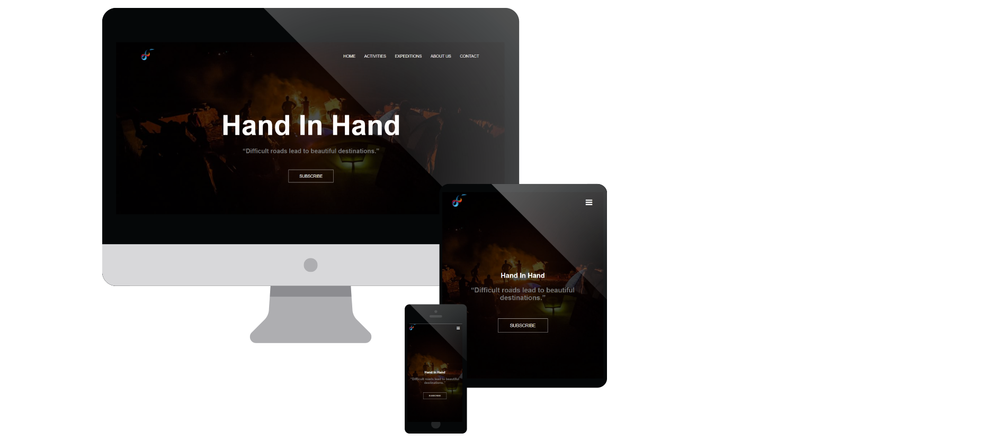
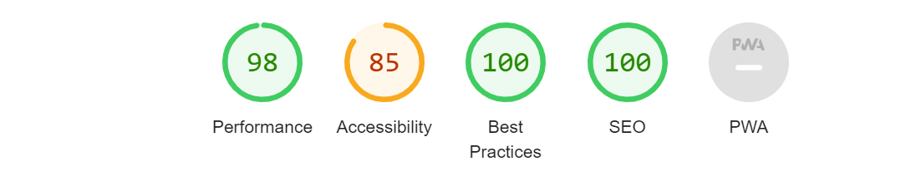
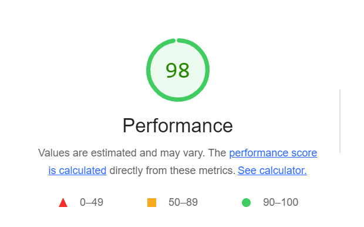
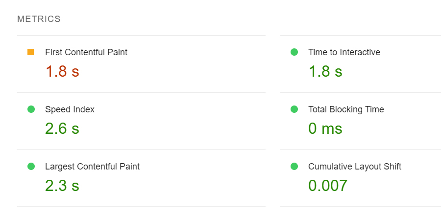

## Introduction:
 Static front-end site using HTML and CSS based on the principles of user experience design, accessibility and responsivity.
Hand in hand is a single web page which serve sustainable tourism, the main purpose of this web-page is to promote sustainable tourism in the rural area.

## Home Page

## Activities Page

## Contact and Newsletter Page:

## Mobile friendly

## Deployment

- The site was deployed to GitHub pages. The steps to deploy are as follows: 
  - In the GitHub repository, navigate to the Settings tab 
  - From the source section drop-down menu, select the Master Branch
  - Once the master branch has been selected, the page will be automatically refreshed with a detailed ribbon display to indicate the successful deployment. 

## Technology used 

- HTML5
The project uses HyperText Markup Language.

- CSS3
The project uses Cascading Style Sheets.

- JavaScript
The project uses JavaScript.

## Testing
<b>Google Developer Tools<b/>
 For every step along the project developement i have inspect and edited the style using Google developer tools. I also checked the accessibility of the page using Lighthouse.
 

 

 

 
## Responsive Tools
I used responsivedesignchecker.com to make sure that all my pages are responsive to all devices.

## W3C Validator Tools

### HTML and CSS:
I used W3C Markup to check for any errors within the HTML pages.

All errors were minimal eg. Whitespace
 

    
    

 
 The live link can be found here - https://afiay.github.io/Portfolio-Project-1/
