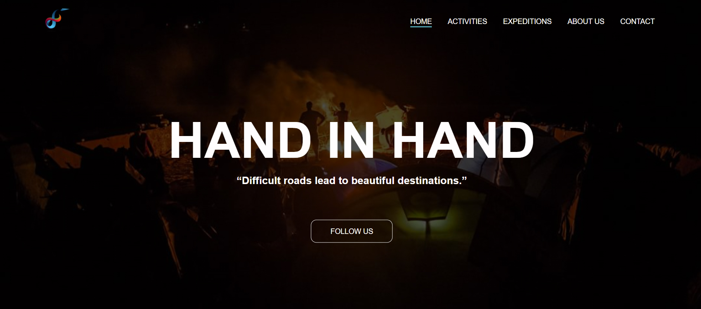

## Introduction:
 Static front-end site using HTML and CSS based on the principles of user experience design, accessibility and responsivity.
Hand in hand is a single web page which serve sustainable tourism, the main purpose of this web-page is to promote sustainable tourism in the rural area.

## Home Page

## Activities Page

## Contact and Newsletter Page:

## Mobile friendly

## Deployment

- The site was deployed to GitHub pages. The steps to deploy are as follows: 
  - In the GitHub repository, navigate to the Settings tab 
  - From the source section drop-down menu, select the Master Branch
  - Once the master branch has been selected, the page will be automatically refreshed with a detailed ribbon display to indicate the successful deployment. 

The live link can be found here - https://afiay.github.io/Portfolio-Project-1/
    
        
    
        

